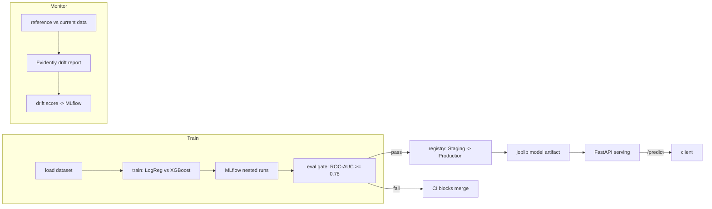

# PredictOps: Production MLOps Pipeline

**CI Eval Gate · Model Registry · Drift Detection**

[](https://github.com/kalyan-venk/PredictOps/actions/workflows/ci.yml)

An end-to-end ML serving pipeline built around the ops loop most portfolio projects skip:
a CI gate that blocks a bad model from merging, a model registry with staged promotion,
and automated drift detection. The model itself is a simple tabular binary classifier
(one bullet below) — it's deliberately boring, because the ops loop is the point.

## What's in the loop

- **Training** (`predictops.train`) — LogReg vs XGBoost, compared via stratified CV, logged
  as nested MLflow runs, winner persisted with `joblib`.
- **Serving** (`predictops.app`) — FastAPI with `/health`, `/predict`, `/info`, `/reload`.
- **CI eval gate** (`.github/workflows/ci.yml`, `tests/test_model_quality.py`) — lint, test,
  and a hard `ROC-AUC >= 0.78` assertion. A model that regresses below the bar fails the build.
- **Registry & promotion** (`predictops.registry`) — registers the best run's model and
  transitions it `Staging -> Production`.
- **Drift detection** (`predictops.drift`) — Evidently `DataDriftPreset` comparing a reference
  split against a synthetically shifted "current" split, with a custom drift-share threshold
  (independent of Evidently's own coarser dataset-level flag) that trips a warning and logs the
  score to MLflow.
- **Containerization** — multi-stage `Dockerfile` (build/train in one stage, slim runtime in
  the next) + `docker-compose.yml` for one-command startup.

Domain note: the dataset behind the model is the public Telco customer-retention dataset —
useful precisely because it's boring and doesn't need feature-engineering rabbit holes.

## Architecture



## Setup

```bash
python3.12 -m venv .venv && source .venv/bin/activate
make install          # pip install -r requirements.txt && pip install -e .
```

## Running the loop

```bash
make train            # load -> train candidates -> log to MLflow -> persist winner
make test             # ruff-clean + pytest, including the eval gate
make drift             # reference vs. shifted-current Evidently report, logged to MLflow
make register          # register winning run's model, promote Staging -> Production
make serve             # uvicorn on :8000
# or the whole thing:
make pipeline          # train -> test -> drift -> register -> serve
```

Docker:

```bash
docker-compose up      # builds the multi-stage image, trains inside the build, serves on :8000
```

## Example API call

```bash
curl -X POST http://localhost:8000/predict \
  -H "Content-Type: application/json" \
  -d '{
    "gender": "Female", "SeniorCitizen": 0, "Partner": "Yes", "Dependents": "No",
    "tenure": 12, "PhoneService": "Yes", "MultipleLines": "No",
    "InternetService": "Fiber optic", "OnlineSecurity": "No", "OnlineBackup": "Yes",
    "DeviceProtection": "No", "TechSupport": "No", "StreamingTV": "Yes",
    "StreamingMovies": "No", "Contract": "Month-to-month", "PaperlessBilling": "Yes",
    "PaymentMethod": "Electronic check", "MonthlyCharges": 85.5, "TotalCharges": 1020.5
  }'
# {"prediction":1,"probability":0.639}
```

## Demonstrating the eval gate

Degrade the model on purpose (e.g. cap `XGBClassifier(n_estimators=1)` and force it as the
winner, or corrupt a preprocessing step) and push — `test_model_quality.py` fails, CI goes red,
and the PR is blocked. Revert and CI goes green again. This is the mechanism that keeps a
regressed model out of production; screenshotting both runs is the interview receipt.

## What I'd do with more time

- Swap MLflow's deprecated stage-based promotion for the newer alias/tag model
  (`@champion`/`@challenger`) — stages still work in 2.16.x but are soft-deprecated.
- Automate the drift check on a schedule (cron / GitHub Actions scheduled workflow) instead of
  running it on demand, and wire a tripped threshold to actually block promotion.
- Push the CI-built image to a real registry (GHCR) instead of stopping at `docker build`.
- Minimal Kubernetes manifests (Deployment + Service, 2 replicas) — intentionally out of scope
  here; I have Docker-only production experience and didn't want to oversell a few hours of k8s.

## Stack

Python, scikit-learn, XGBoost, FastAPI, Pydantic, Docker (multi-stage), docker-compose,
GitHub Actions, MLflow, Evidently, pytest, ruff, joblib.
