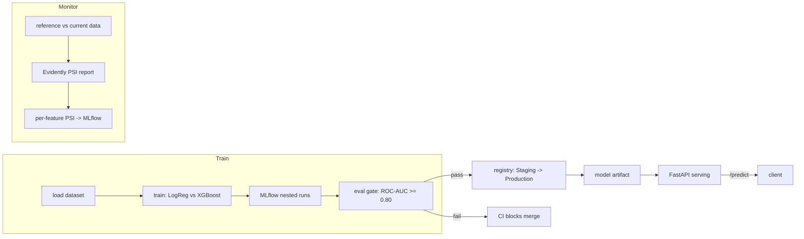

# PredictOps: End-to-End ML Serving Pipeline with Automated Eval Gating

[](https://github.com/kalyan-venk/PredictOps/actions/workflows/ci.yml)

An end-to-end ML serving pipeline built around the ops loop most portfolio projects skip: a CI
gate that blocks a bad model from reaching the registry, staged model promotion, and automated
drift detection. The model itself is a tabular binary classifier on the public Telco churn
dataset — deliberately boring, because the ops loop is the point.

## What it does

- **Model selection** — LogisticRegression benchmarked against XGBoost on 7,043-row Telco churn
  data via stratified 5-fold CV, selecting the tighter cross-validated model (0.846 vs 0.842
  ROC-AUC) and confirming it held on a 20% held-out split (0.842 ROC-AUC, 80.6% accuracy).
- **Serving** — the selected model behind a FastAPI layer (`/health`, `/predict`, `/info`,
  `/reload`; 19 Pydantic-validated and enum-constrained fields) in a multi-stage Docker image,
  cutting deployed image size from ~1.2GB to ~340MB, a 72% reduction.
- **CI eval gate** — a GitHub Actions quality contract that hard-blocks any push below
  ROC-AUC ≥ 0.80 from reaching the MLflow registry. Verified by shipping a deliberately degraded
  model, watching CI fail, then fixing it to pass.
- **Drift detection** — Evidently on a reference-vs-current split, logging a per-feature PSI
  score and tripping a threshold alert at PSI > 0.15 on injected shift. The runtime counterpart
  to the CI gate's train-time guarantee.

## Architecture



## Setup

```bash
python3.12 -m venv .venv && source .venv/bin/activate
make install          # pip install -r requirements.txt && pip install -e .
```

## Running the loop

```bash
make train            # load -> train candidates -> log to MLflow -> persist winner
make test             # ruff-clean + pytest, including the eval gate
make drift            # reference vs. shifted-current Evidently report, logged to MLflow
make register         # register winning run's model, promote Staging -> Production
make serve            # uvicorn on :8000
# or the whole thing:
make pipeline         # train -> test -> drift -> register -> serve
```

Docker:

```bash
docker-compose up      # builds the multi-stage image, trains inside the build, serves on :8000
```

## Example API call

```bash
curl -X POST http://localhost:8000/predict \
  -H "Content-Type: application/json" \
  -d '{
    "gender": "Female", "SeniorCitizen": 0, "Partner": "Yes", "Dependents": "No",
    "tenure": 12, "PhoneService": "Yes", "MultipleLines": "No",
    "InternetService": "Fiber optic", "OnlineSecurity": "No", "OnlineBackup": "Yes",
    "DeviceProtection": "No", "TechSupport": "No", "StreamingTV": "Yes",
    "StreamingMovies": "No", "Contract": "Month-to-month", "PaperlessBilling": "Yes",
    "PaymentMethod": "Electronic check", "MonthlyCharges": 85.5, "TotalCharges": 1020.5
  }'
# {"prediction":1,"probability":0.639}
```

## Stack

Python, scikit-learn, XGBoost, FastAPI, Pydantic, Docker (multi-stage), docker-compose,
GitHub Actions, MLflow, Evidently, pytest, ruff.
